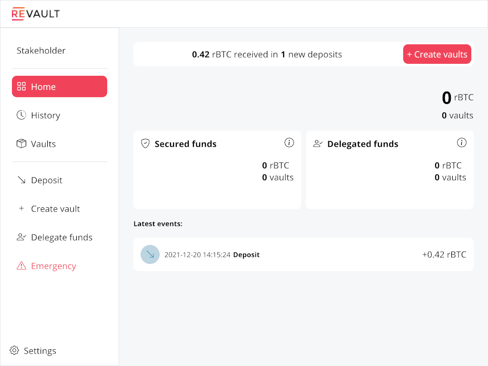
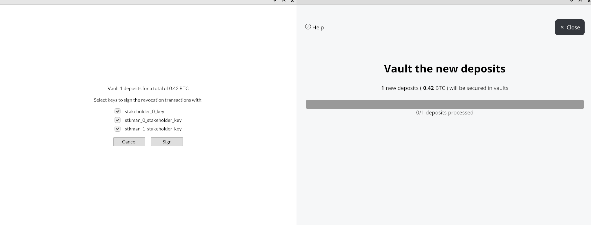
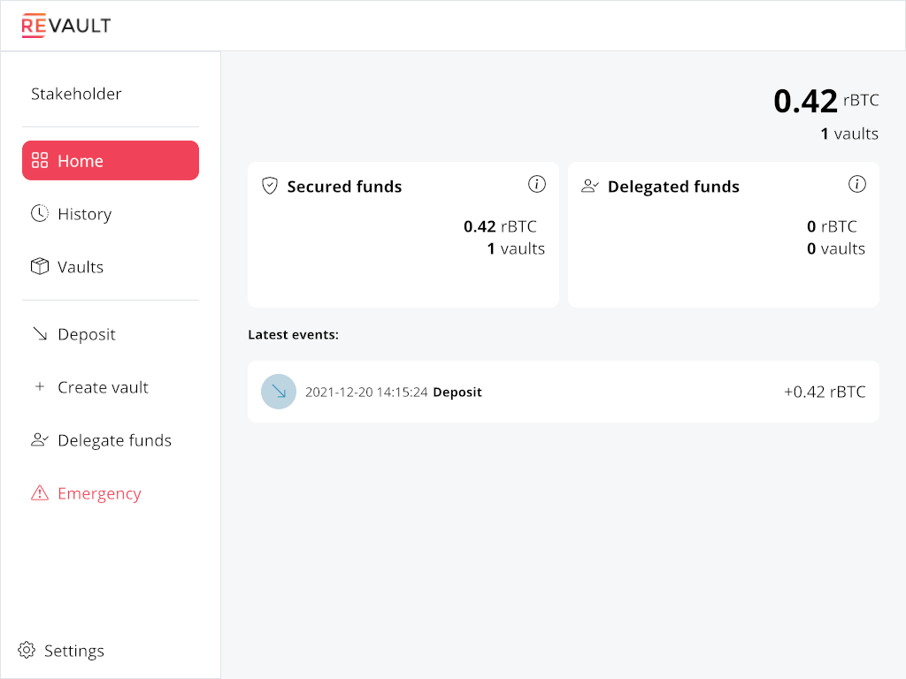
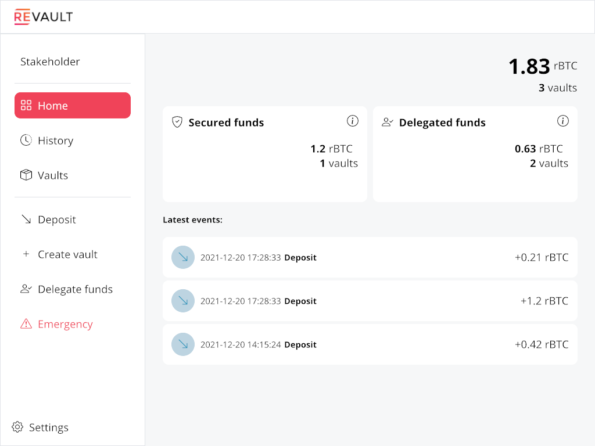
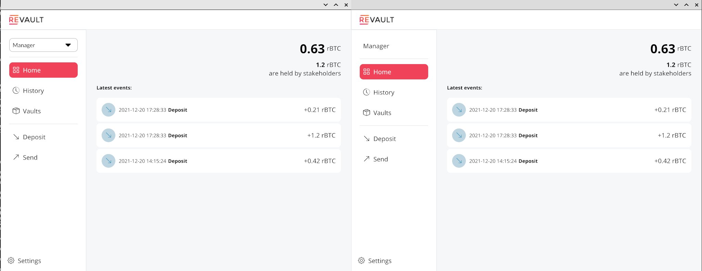
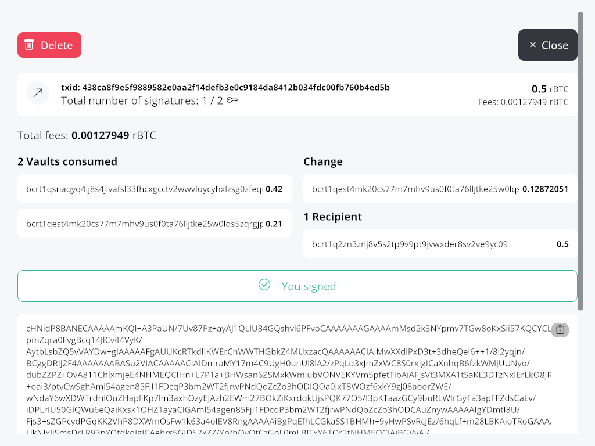
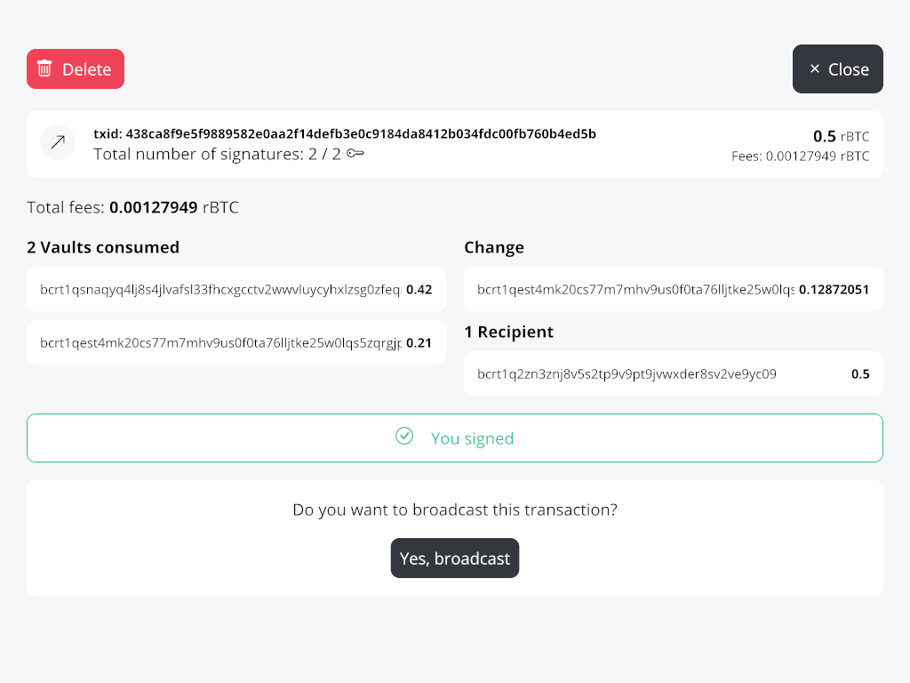
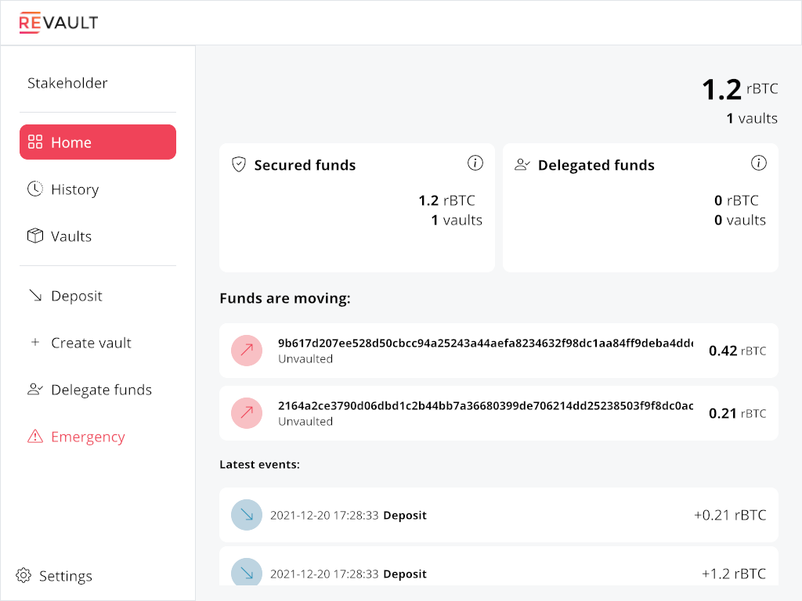
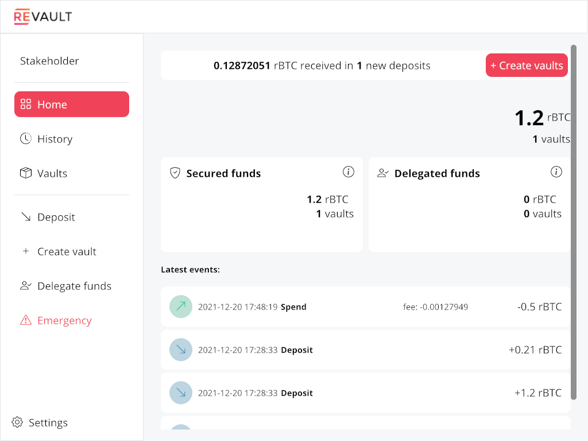

# Aquarium 🧙 🐟

A Revault sandbox

## About

Being a complete custody solution, configuring all the parts of a Revault deployment is a bit
tedious. Aquarium is a Python script re-using [`revaultd`](https://github.com/revault/revaultd)'s
functional testing framework to provide a turnkey solution to deploy a Revault setup on a regtest
network.

The [`aquarium.py`](aquarium.py) script will fetch the source of the different Revault binaries 
(`revaultd`, `revault-gui`, `coordinatord`, `cosignerd`) at a given version, compile them using
[`Cargo`](https://doc.rust-lang.org/cargo/), start a (single) `bitcoind` in `regtest` mode, hook
into the [`test_framework`](`test_framework/`) to write all the configuration (Bitcoin keys,
communication keys, script descriptors, connections, ..) and finally drop you in a shell with
pre-defined `alias`es.

The aquarium only runs on Unix systems for now.

## Usage

Clone the `aquarium` repo first:
```
git clone https://github.com/revault/aquarium
cd aquarium
```

### Dependencies

If you don't already have `bitcoind` installed, you can get it from [bitcoincore.org](https://bitcoincore.org/en/download/)
or compile it from [the source](https://github.com/bitcoin/bitcoin/tree/master/doc#bitcoin-core).
The minimum supported version is `22.0`. You'll need to have an accessible `bitcoind` via your
environment or to set the `BITCOIND_PATH` variable.

The testing framework has a few dependencies (for key generation, DB connection and bitcoind RPC
mocking specifically). The recommended method for installing them is by using a [`venv`](https://docs.python.org/3/library/venv.html).
```
python3 -m venv venv
. venv/bin/activate
pip install -r requirements.txt
```

Also, you will need to install [`Cargo`](https://doc.rust-lang.org/cargo/getting-started/installation.html)
which you very likely already have installed if you have a Rust toolchain.

You will need a version of at least `1.43` for building `revaultd`, `coordinatord` and `cosignerd`.
If you are going to use the GUI, the latest stable version is required to build `revault-gui`. You
can check your version with:
```
cargo --version
```

Finally, the GUI has a [few dependencies](https://github.com/revault/revault-gui#dependencies).

### Running

To deploy Revault you'll need to specify the number of Stakeholders (participants not taking
actively part in spendings but pre-signing authorizations of spending), Managers (participants
taking part in spending using the pre-signed transactions) and Stakeholders-Managers (participants
acting as both), and the Unvault timelock duration (number of blocks during which any participant
or watchtower can Cancel a spending attempt). Optionally, you can also set a threshold for the
managers (eg `2` out of the `3` managers are enough to Spend a pre-signed Unvault):
```
$ ./aquarium.py --help
usage: aquarium.py [-h] -stks STAKEHOLDERS -mans MANAGERS -stkmans
                   STAKEHOLDER_MANAGERS -csv TIMELOCK
                   [-mansthresh MANAGERS_THRESHOLD] [-cosigs]
                   [-policy POLICIES]

optional arguments:
  -h, --help            show this help message and exit

Deployment configuration:
  -stks STAKEHOLDERS, --stakeholders STAKEHOLDERS
                        The number of only-stakeholder
  -mans MANAGERS, --managers MANAGERS
                        The number of only-manager
  -stkmans STAKEHOLDER_MANAGERS, --stakeholder-managers STAKEHOLDER_MANAGERS
                        The number of both stakeholder-manager
  -csv TIMELOCK, --timelock TIMELOCK
                        The number of blocks during which an Unvault attempt
                        can be canceled
  -mansthresh MANAGERS_THRESHOLD, --managers-threshold MANAGERS_THRESHOLD
  -cosigs, --with-cosigning-servers
                        Enable cosigning servers to allow Spend policies at
                        the cost of weaker assumptions
  -policy POLICIES, --spending-policy POLICIES
                        Enforce a spending policy on all watchtowers by
                        specifying a path to a watchtower plugin. Specify this
                        option multiple times to enable multiple policies.
```

Assuming you want to deploy a Revault setup with 1 Stakeholder, 1 Manager and 2
Stakeholder-Managers who can Spend with a threshold of `2` after `6` blocks (and no automated
spending policy):
```
./aquarium.py --stakeholders 1 --managers 1 --stakeholder-managers 2 --timelock 6 --managers-threshold 2
```

You will get into a shell where you can use the `alias`es to start messing around (you can consult
them at any time using the `alias` command):
```
Available aliases: 
alias bd="bitcoind -datadir='/home/darosior/projects/revault/aquarium/demo/bitcoind'"
alias bcli="bitcoin-cli -datadir='/home/darosior/projects/revault/aquarium/demo/bitcoind' -rpcwallet='revaultd-tests'"
alias stk0cli="/home/darosior/projects/revault/aquarium/src/revaultd/target/debug/revault-cli --conf /home/darosior/projects/revault/aquarium/demo/revaultd-stk-0/config.toml"
alias stk0d="/home/darosior/projects/revault/aquarium/test_framework/../../target/debug/revaultd --conf /home/darosior/projects/revault/aquarium/demo/revaultd-stk-0/config.toml"
alias stk0gui='/home/darosior/projects/revault/aquarium/src/revault-gui/target/debug/revault-gui --conf /home/darosior/projects/revault/aquarium/demo/revaultd-stk-0/regtest/gui_config.toml'
alias man0cli="/home/darosior/projects/revault/aquarium/src/revaultd/target/debug/revault-cli --conf /home/darosior/projects/revault/aquarium/demo/revaultd-man-0/config.toml"
alias man0d="/home/darosior/projects/revault/aquarium/test_framework/../../target/debug/revaultd --conf /home/darosior/projects/revault/aquarium/demo/revaultd-man-0/config.toml"
alias man0gui='/home/darosior/projects/revault/aquarium/src/revault-gui/target/debug/revault-gui --conf /home/darosior/projects/revault/aquarium/demo/revaultd-man-0/regtest/gui_config.toml'
alias stkman0cli="/home/darosior/projects/revault/aquarium/src/revaultd/target/debug/revault-cli --conf /home/darosior/projects/revault/aquarium/demo/revaultd-stkman-0/config.toml"
alias stkman0d="/home/darosior/projects/revault/aquarium/test_framework/../../target/debug/revaultd --conf /home/darosior/projects/revault/aquarium/demo/revaultd-stkman-0/config.toml"
alias stkman0gui='/home/darosior/projects/revault/aquarium/src/revault-gui/target/debug/revault-gui --conf /home/darosior/projects/revault/aquarium/demo/revaultd-stkman-0/regtest/gui_config.toml'
alias stkman1cli="/home/darosior/projects/revault/aquarium/src/revaultd/target/debug/revault-cli --conf /home/darosior/projects/revault/aquarium/demo/revaultd-stkman-1/config.toml"
alias stkman1d="/home/darosior/projects/revault/aquarium/test_framework/../../target/debug/revaultd --conf /home/darosior/projects/revault/aquarium/demo/revaultd-stkman-1/config.toml"
alias stkman1gui='/home/darosior/projects/revault/aquarium/src/revault-gui/target/debug/revault-gui --conf /home/darosior/projects/revault/aquarium/demo/revaultd-stkman-1/regtest/gui_config.toml'
alias hw='/home/darosior/projects/revault/aquarium/src/revault-gui/contrib/tools/dummysigner/target/debug/dummysigner --conf /home/darosior/projects/revault/aquarium/demo/dummysigner.toml'
```

Here is an example funding a new deposit using the CLI (you can also get an address using the GUI):
```
(Revault demo) darosior@darosior:~/projects/revault/aquarium$ stkman1cli getdepositaddress
{
  "result": {
    "address": "bcrt1qsnaqyq4lj8s4jlvafsl33fhcxgcctv2wwvluycyhxlzsg0zfeqrqxdr0t9"
  }
}
```

So we got a deposit address. Let's send some coins to it.
```
(Revault demo) darosior@darosior:~/projects/revault/aquarium$ stkman1cli listvaults
{
  "result": {
    "vaults": []
  }
}
(Revault demo) darosior@darosior:~/projects/revault/aquarium$ bcli sendtoaddress bcrt1qsnaqyq4lj8s4jlvafsl33fhcxgcctv2wwvluycyhxlzsg0zfeqrqxdr0t9 0.42
9b617d207ee528d50cbcc94a25243a44aefa8234632f98dc1aa84ff9deba4dde
```

The daemon won't consider unconfirmed deposit (a single confirmation for aquarium's configuration,
but the default is higher).
```
(Revault demo) darosior@darosior:~/projects/revault/aquarium$ bcli generatetoaddress 7 $(bcli getnewaddress) 
[
  "03dedb10899ac34bc0e36d56c69689e6b50d4bca94d6d9e6f85a51be0f10e692"
]
(Revault demo) darosior@darosior:~/projects/revault/aquarium$ stkman1cli listvaults
{
  "result": {
    "vaults": [
      {
        "address": "bcrt1qsnaqyq4lj8s4jlvafsl33fhcxgcctv2wwvluycyhxlzsg0zfeqrqxdr0t9",
        "amount": 42000000,
        "blockheight": 102,
        "delegated_at": null,
        "derivation_index": 0,
        "funded_at": 1640009724,
        "moved_at": null,
        "secured_at": null,
        "status": "funded",
        "txid": "9b617d207ee528d50cbcc94a25243a44aefa8234632f98dc1aa84ff9deba4dde",
        "vout": 1
      }
    ]
  }
}
```

To launch the GUI for one of the participants:
```
stk0gui >/dev/null &
```
(redirecting `stdout` here to avoid getting annoyed by the logs)

The above line will start the GUI of the first stakeholder. You can then create a vault out of
a deposit by signing the revocation transactions.


For testing purposes `revault-gui` provides a dummy signer mocking the flow of signing the
transactions on a compatible hardware wallet. Because a dummy signer to manage in addition to each
participants' GUI would be too much, by default Aquarium configures a single dummy signer for all
the keys (and you can choose which keys to sign for at runtime). Start the dummy signer with the
following alias:
```
hw >/dev/null &
```

We'll directly sign with all the stakeholders' keys. For "The Real Revault Experience" (tm) or
testing purposes, you can sign for each stakeholder by starting each of their GUI and selecting
their key on the dummy signer.



The same goes for delegation. Let's create two new vaults, secure them and delegate only 2 out of
the 3 secured vaults.
```
$ bcli sendtoaddress bcrt1qest4mk20cs77m7mhv9us0f0ta76lljtke25w0lqs5zqrgjp8v9uq7z2wy2 0.21
2164a2ce3790d06dbd1c2b44bb7a36680399de706214dd25238503f9f8dc0ac9
$ bcli sendtoaddress bcrt1qest4mk20cs77m7mhv9us0f0ta76lljtke25w0lqs5zqrgjp8v9uq7z2wy2 1.2
d1e15483e5d1c1415f4e52b2921b0246fa890d2f6fe40b23c8ecdc46e7785028
$ bcli generatetoaddress 1 $(bcli getnewaddress)
[
  "5ee061f2e178a455be458dd7629e60f0d5b235940ebe4c1fa7bbfce4c3cebc76"
]
```

We now have `1.83` BTC under custody, with `0.63` available to managers in 2 vaults. Availability
here depends of course of hypothetical spending policy we could enforce manually or with watchtowers
(but we didn't in order to keep this walkthrough concise).


Now we can start 2 managers (remember, there are 3 managers but the threshold for spending is only
of 2).
```
$ man0gui >/dev/null &
$ stkman0gui >/dev/null &
$ bcli getnewaddress
bcrt1q2zn3znj8v5s2tp9v9pt9jvwxder8sv2ve9yc09
```

Thend create a Spend transaction and sign it with the first one, make the second sign and then
broadcast it.




Now let's confirm the Unvault transactions.
```
$ bcli generatetoaddress 1 $(bcli getnewaddress)
[
  "0588055b747847ecf0281d708e16378f60f0944dcaff5d7926374e5f3f14c897"
]
```

And back on the stakeholder's screen. We have 6 blocks to Cancel the unvaulting but choose to let it
go through.


By then mining the 6 blocks for the locktime to mature and 1 block to confirm the Spend after it was
broadcast, the spending is finalized.
```
$ bcli generatetoaddress 6 $(bcli getnewaddress)
[
  "0780bb19c7f2bf51e54b517e261e5b3097447789f01488e743d5d8620b726953",
  "6c8dbc310b9034670cc353e1a8081d34d7275c03d286f3a253abbfa36d9c243f",
  "5282fe85d891d479dc6bb8a163e345f1e828e2791b0e0ff472b0e374d5045aa3",
  "0f9a31ff7ee459f949d416d1d05b04e7d6fb7c5881edb4003f4768d491e668b4",
  "767d4b951c25a18ac290d4421203daf224e43a1dbcd8eb4817196208dfba0abc",
  "717f66acb946e222d94107f2574a630afb5f14f842264b193b03b5b54845293d"
]
$ bcli generatetoaddress 1 $(bcli getnewaddress)
[
  "3659cb6fd76c646ed9f59e64646cea738718acc4ac55271bf4ea1d7480c09b39"
]
```



### Running with `coordinatord`

By default, Aquarium will use a dummy fully in-RAM coordinator. If you are willing to use the "real"
coordinator, you first need to set up a PostgreSQL backend.

The easiest way to do so is by using [Docker](https://docs.docker.com/engine/install/):
```
docker run --rm -d -p 5432:5432 --name postgres-coordinatord -e POSTGRES_PASSWORD=revault -e POSTGRES_USER=revault -e POSTGRES_DB=coordinator_db postgres:alpine
```
If you already have a Postgre backend set up, the script will just need credentials (and optionally
a `POSTGRES_HOST`) and will take care of creating the database (and removing it at teardown).

Assuming you've set a PostgreSQL backend with credentials `revault:revault` as with the Docker
example above, and you want to deploy a Revault setup with 1 Stakeholder, 1 Manager and 2
Stakeholder-Managers who can Spend with a threshold of `2` after `6` blocks (and no automated
spending policy):
```
POSTGRES_USER=revault POSTGRES_PASS=revault ./aquarium.py --stakeholders 1 --managers 1 --stakeholder-managers 2 --timelock 6 --managers-threshold 2
```


### Tweaking

You can disable the GUI by setting the `WITH_GUI` environment variable to `0`. This saves a
considerable amount of time (`revault-gui` compilation).

The shell you are being dropped in is set to `bash` by default. This can be modified using the
`SHELL` environment variable, however this has only been tested with `bash`. In fact, it would most
likely break at the moment with another shell as we are using `--init-file` to provide `alias`es.

By default, all data directories are created in a `demo` parent directory created in the current
working directory. This can be changed using the `BASE_DIR` environment variable.

You can adjust the logging level using the `LOG_LEVEL` environment variable. This will affect the
daemons logs and test framework verbosity.

You can set a single dummy signer for each participant and have an `alias` for each by setting
`WITH_ALL_HWS=1`.

See [`aquarium.py`] for more environment variable. Notably, you can change the source code version
being fetched, and the directory in which repos are `git clone`d.

## Contributing

Contributions are very welcome, and especially for documentation that may be unclear to someone
external to the project or fixups to the `aquarium.py` script for environments we haven't tested in
ourselves!

For code modification, please bear in mind that we want to keep the divergence between this repo's
`test_framework` and `revaultd`'s one as low as possible to reduce the maintenance burden of
maintaining this repo up-to-date. If you have a fix for the `test_framework` itself, prefer proposing
it upstream to [`revaultd`](https://github.com/revault/revaultd).
